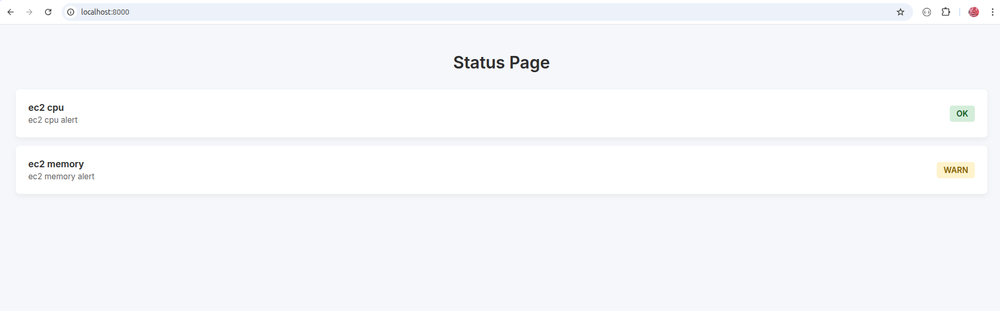

# Status Page: Datadog Monitor

A modern, elegant status page application built with **React**, **shadcn/ui**, and **FastAPI** that displays real-time service health monitoring from **Datadog** with incident timeline notifications.

The page consumes data directly from **Datadog monitors** and displays their current state in a beautiful, responsive interface with a complete incident management timeline for customer communication.

---

## Features

### 🎨 Modern UI
- **shadcn/ui components** - Beautiful, accessible UI components
- **Tailwind CSS** - Modern, responsive design
- **Dark mode ready** - Pre-configured color schemes
- **Auto-refresh** - Updates every 60 seconds automatically

### 📊 Service Monitoring
- Real-time status from Datadog monitors
- Color-coded status badges (Operational, Degraded, Outage)
- Service descriptions and detailed information
- Overall system health indicator

### 📢 Incident Timeline
- **Customer notifications** - Inform customers about ongoing issues
- **Timeline view** - Chronological updates for each incident
- **Status tracking** - Investigating → Identified → Monitoring → Resolved
- **Severity levels** - Minor, Major, Critical incidents
- **Last 30 days** - Automatic filtering of recent incidents
- **Affected services** - See which services are impacted

### 🔧 Technical
- **FastAPI** backend with async support
- **React + TypeScript** frontend
- **Docker** containerization for easy deployment
- **JSON-based** configuration (no database required)
- **CORS** enabled for development
- **Nginx** for production serving

---

## Architecture

```
┌─────────────────┐         ┌──────────────────┐         ┌─────────────────┐
│   React SPA     │ ──────> │  FastAPI Backend │ ──────> │  Datadog API    │
│  (Port 80)      │  /api/* │   (Port 8000)    │         │                 │
│                 │         │                  │         │                 │
│  shadcn/ui      │         │  monitors.json   │         │  Monitor Status │
│  Tailwind CSS   │         │  incidents.json  │         │                 │
└─────────────────┘         └──────────────────┘         └─────────────────┘
```

---

## Quick Start

### 1. Clone the repository

```bash
git clone https://github.com/rmnobarra/status-page-datadog-monitor.git
cd status-page-datadog-monitor
```

### 2. Configure environment variables

Create a `.env` file with your Datadog credentials:

```bash
DATADOG_API_KEY=your_api_key_here
DATADOG_APP_KEY=your_app_key_here
DATADOG_API_HOST=https://api.us5.datadoghq.com
```

> **Note:** Change `DATADOG_API_HOST` to match your Datadog region (us5, eu, ap1, etc.)

### 3. Configure monitors

Edit `monitors.json` with the monitors you want to display:

```json
[
  {
    "url_monitor": "123456789",
    "nome_monitor": "Authentication Service",
    "descricao_monitor": "User authentication and authorization system"
  },
  {
    "url_monitor": "987654321",
    "nome_monitor": "Database",
    "descricao_monitor": "Primary PostgreSQL database"
  }
]
```

### 4. Configure incidents (optional)

Edit `incidents.json` to add incident notifications for your customers:

```json
[
  {
    "id": "INC-2025-001",
    "title": "API Performance Degradation",
    "status": "monitoring",
    "severity": "major",
    "created_at": "2025-11-28T10:00:00",
    "resolved_at": null,
    "affected_services": ["Authentication Service", "API"],
    "updates": [
      {
        "timestamp": "2025-11-28T10:00:00",
        "status": "investigating",
        "message": "We are investigating reports of slow API response times."
      },
      {
        "timestamp": "2025-11-28T10:30:00",
        "status": "identified",
        "message": "Issue identified: Database query optimization needed. Team is working on a fix."
      },
      {
        "timestamp": "2025-11-28T11:00:00",
        "status": "monitoring",
        "message": "Fix deployed. Monitoring performance closely."
      }
    ]
  }
]
```

#### Incident Status Values:
- `investigating` - Team is looking into the issue
- `identified` - Root cause has been found
- `monitoring` - Fix deployed, watching for stability
- `resolved` - Issue completely resolved

#### Severity Levels:
- `minor` - Small impact, limited users affected
- `major` - Significant impact, service degraded
- `critical` - Severe impact, service down

### 5. Run with Docker Compose (Recommended)

```bash
docker-compose up --build
```

The application will be available at:
- **Frontend:** http://localhost
- **Backend API:** http://localhost:8000
- **API Docs:** http://localhost:8000/docs

### 6. Run for development

#### Backend:
```bash
# Install Python dependencies
pip install -r requirements.txt

# Run the backend
uvicorn app.main:app --reload
```

#### Frontend:
```bash
# Navigate to frontend directory
cd frontend

# Install dependencies
npm install

# Run development server
npm run dev
```

Frontend will be available at http://localhost:5173 (Vite dev server)

---

## API Endpoints

### `GET /api/monitors`
Returns the status of all configured monitors.

**Response:**
```json
{
  "monitors": [
    {
      "id": 123456789,
      "name": "Authentication Service",
      "description": "User authentication system",
      "status": "OK"
    }
  ]
}
```

### `GET /api/incidents`
Returns recent incidents (last 30 days).

**Response:**
```json
{
  "incidents": [
    {
      "id": "INC-2025-001",
      "title": "API Performance Issue",
      "status": "resolved",
      "severity": "major",
      "created_at": "2025-11-20T14:30:00",
      "resolved_at": "2025-11-20T16:45:00",
      "affected_services": ["API"],
      "updates": [...]
    }
  ]
}
```

### `GET /api/status`
Returns overall system status.

**Response:**
```json
{
  "status": "operational",
  "updated_at": "2025-11-28T12:00:00"
}
```

Status values: `operational`, `partial_outage`, `major_outage`, `unknown`

---

## Project Structure

```
status-page-datadog-monitor/
├── app/                          # Backend application
│   ├── config.py                # Environment configuration
│   ├── datadog_client.py        # Datadog API client
│   ├── main.py                  # FastAPI application
│   └── templates/               # Legacy Jinja2 templates
│       └── status.html
│
├── frontend/                     # React frontend
│   ├── src/
│   │   ├── components/
│   │   │   ├── ui/              # shadcn/ui components
│   │   │   │   ├── card.tsx
│   │   │   │   └── badge.tsx
│   │   │   ├── MonitorCard.tsx  # Service status card
│   │   │   └── IncidentTimeline.tsx
│   │   ├── lib/
│   │   │   └── utils.ts         # Utility functions
│   │   ├── types/
│   │   │   └── index.ts         # TypeScript types
│   │   ├── App.tsx              # Main application
│   │   ├── index.css            # Tailwind CSS
│   │   └── main.tsx
│   ├── Dockerfile               # Frontend Docker config
│   ├── nginx.conf               # Nginx configuration
│   ├── package.json
│   ├── tailwind.config.js
│   └── vite.config.ts
│
├── monitors.json                 # Monitor configuration
├── incidents.json                # Incident notifications
├── .env                          # Environment variables
├── .env.sample                   # Environment template
├── Dockerfile                    # Backend Docker config
├── docker-compose.yaml           # Docker Compose config
├── requirements.txt              # Python dependencies
└── README.md
```

---

## Configuration Files

### monitors.json
Defines which Datadog monitors to display on the status page.

**Fields:**
- `url_monitor` - Datadog monitor ID (get from monitor URL)
- `nome_monitor` - Display name for the service
- `descricao_monitor` - Brief description of the service

### incidents.json
Stores incident notifications to inform customers about issues.

**Fields:**
- `id` - Unique incident identifier
- `title` - Incident title
- `status` - Current status (investigating/identified/monitoring/resolved)
- `severity` - Impact level (minor/major/critical)
- `created_at` - ISO 8601 timestamp when incident started
- `resolved_at` - ISO 8601 timestamp when resolved (null if ongoing)
- `affected_services` - Array of affected service names
- `updates` - Array of status updates with timestamp, status, and message

---

## Deployment

### Production with Docker Compose

```bash
# Build and start services
docker-compose up -d --build

# View logs
docker-compose logs -f

# Stop services
docker-compose down
```

### Manual Deployment

#### Backend:
```bash
# Install dependencies
pip install -r requirements.txt

# Run with Gunicorn
gunicorn app.main:app -k uvicorn.workers.UvicornWorker -w 4 -b 0.0.0.0:8000
```

#### Frontend:
```bash
cd frontend

# Install dependencies
npm ci --production

# Build
npm run build

# Serve with any static file server
npx serve -s dist -l 80
```

---

## Customization

### Changing Colors
Edit `frontend/src/index.css` to customize the color scheme using CSS variables.

### Changing Refresh Interval
Edit `frontend/src/App.tsx` line 42 - change `60000` (60 seconds) to your desired interval in milliseconds.

### Adding More UI Components
Use [shadcn/ui documentation](https://ui.shadcn.com/) to add more components:

```bash
npx shadcn-ui@latest add button
npx shadcn-ui@latest add alert
```

---

## Screenshots

### Legacy Interface


### New React Interface
The new interface features:
- Clean, modern design with shadcn/ui
- Real-time status indicators with icons
- Expandable incident timeline with detailed updates
- Responsive layout for mobile and desktop
- Auto-refresh functionality

---

## Troubleshooting

### CORS Issues
If you see CORS errors in development, ensure the backend's CORS middleware includes your frontend URL in `app/main.py`:

```python
app.add_middleware(
    CORSMiddleware,
    allow_origins=["http://localhost:5173", "http://localhost:3000"],
    ...
)
```

### Datadog API Errors
- Verify your API and App keys are correct
- Check that the Datadog API host matches your region
- Ensure monitor IDs in `monitors.json` exist in your Datadog account

### Build Errors
If frontend build fails:
```bash
cd frontend
rm -rf node_modules package-lock.json
npm install
npm run build
```

---

## Contributing

Contributions are welcome! Please feel free to submit a Pull Request.

---

## License

This project is open source and available under the MIT License.

---

## Support

For issues or questions:
- Open an issue on GitHub
- Check existing issues for solutions
- Review Datadog API documentation

---

**Built with ❤️ using FastAPI, React, shadcn/ui, and Datadog**
